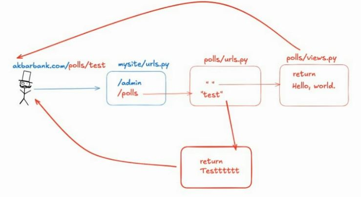

# Django 
<br>

# How to run 


```
0.  python -m venv .venv
    ./.venv/Scripts/activate

1. django-admin startproject mysite .

2. python manage.py startapp polls 

```
<br>


write something in polls/views.py (html pages) .

```
mysite --> urls.py     --> (main url)
              |
              V
polls --> urls.py  
              |
              V
polls --> views.py 
```


<br>

# How to work with Database in Django :
```
3. python manage.py migrate
```
+ we will have these 4 default Django's models : ```Apply all migrations: admin, auth, contenttypes, sessions```


+ In polls/models.py , write 2 classes(models) : 
    1_ class Question 
    2_ class Choice

+ because we have created new models , we must run a ``` makemigrations ``` : 
```
4. python manage.py makemigrations polls
```
+ but we will get this error : ```No installed app with label 'polls'.``` <br>
+ because in ```mysite/setting.py``` , in ```INSTALLED_APPS```, we didn't have polls app , so we add polls to ```INSTALLED_APPS``` variable : <br>
```
INSTALLED_APPS = [
    .
    .

    'polls.apps.PollsConfig',
]
```
check those 2 models in this new file : 
``` polls/migrations/0001_initial.py```

## after each makemigration , run a migrate as well:
```
5. python manage.py migrate
```

now we have ```polls``` as an App .

+ Finally :
```
6. python manage.py runserver
```

+ in sqlite database , two ```polls_choice``` & ```polls_question``` tables are created .


<br>
<br>

